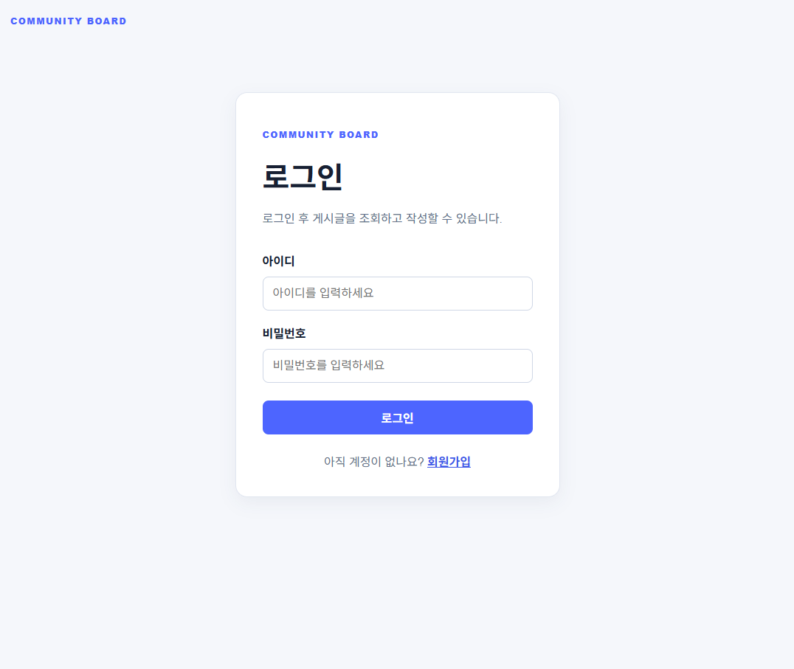
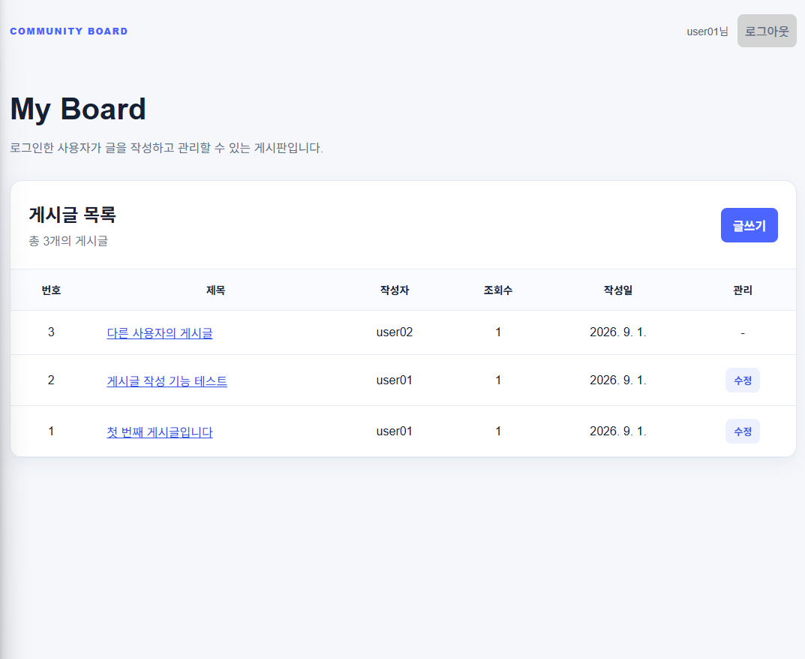
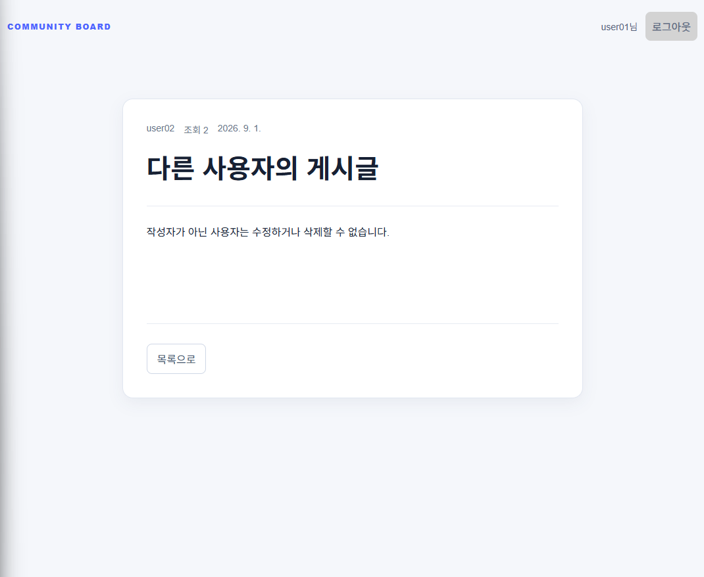

# My Board

React, Express, MongoDB 기반의 JWT 인증 커뮤니티 게시판입니다.  
회원가입·로그인 후 게시글을 조회하고 작성할 수 있으며, 작성자 본인만 게시글을 수정하거나 삭제할 수 있도록 권한을 처리했습니다.

## 주요 기능

- 회원가입 및 로그인
- JWT 토큰 기반 사용자 인증
- 인증된 사용자만 게시글 목록 및 상세 조회
- 게시글 작성
- 게시글 상세 조회 및 조회수 증가
- 작성자 본인만 게시글 수정·삭제
- 다른 사용자의 게시글 수정·삭제 제한
- WebStorm HTTP Client 기반 API 테스트

## 화면 미리보기

### 1. 로그인 및 회원가입

로그인 성공 시 JWT 토큰을 발급하고 브라우저에 저장합니다.  
계정이 없는 사용자는 회원가입 화면으로 이동할 수 있습니다.



### 2. 게시글 목록

인증된 사용자의 게시글 목록을 조회합니다.  
현재 로그인한 `user01`에게는 본인이 작성한 게시글에만 수정 버튼이 표시됩니다.



### 3. 게시글 상세 및 작성자 권한 제어

`user01`이 다른 사용자(`user02`)의 게시글을 조회한 화면입니다.  
작성자가 아니므로 수정·삭제 버튼이 표시되지 않습니다.



## 기술 스택

| 구분 | 기술 |
|---|---|
| Frontend | React, Vite, React Router, CSS |
| Backend | Node.js, Express |
| Database | MongoDB, Mongoose |
| Authentication | JSON Web Token, bcrypt |
| API Test | WebStorm HTTP Client |
| Version Control | Git, GitHub |

## 프로젝트 구조

```text
my_board_project
├── backend
│   ├── middlewares
│   │   └── requireAuth.js
│   ├── models
│   │   ├── Post.js
│   │   └── User.js
│   ├── board-api.http
│   ├── package.json
│   └── server.js
├── frontend
│   ├── src
│   │   ├── components
│   │   ├── pages
│   │   ├── App.css
│   │   ├── App.jsx
│   │   └── main.jsx
│   └── package.json
├── docs
│   └── screenshots
├── .gitignore
└── README.md
```

## 실행 방법

### 1. MongoDB 실행

로컬 MongoDB 서버를 실행합니다.

```text
mongodb://127.0.0.1:27017/my_board_db
```

### 2. 백엔드 실행

```bash
cd backend
npm install
node server.js
```

`backend/.env.example`을 참고해 `backend/.env` 파일을 만들고 JWT 비밀키를 설정합니다.

```env
JWT_SECRET=your-local-secret-key

백엔드 서버는 `http://localhost:4000`에서 실행됩니다.

### 3. 프론트엔드 실행

새 Terminal에서 실행합니다.

```bash
cd frontend
npm install
npm run dev
```

프론트엔드는 `http://localhost:5173`에서 실행됩니다.

## API 목록

| Method | URL | 인증 | 설명 |
|---|---|:---:|---|
| POST | `/api/auth/register` | X | 회원가입 |
| POST | `/api/auth/login` | X | 로그인 및 JWT 발급 |
| GET | `/api/auth/me` | O | 로그인 사용자 확인 |
| GET | `/api/posts` | O | 게시글 목록 조회 |
| POST | `/api/posts` | O | 게시글 작성 |
| GET | `/api/posts/:id` | O | 게시글 상세 조회 및 조회수 증가 |
| PATCH | `/api/posts/:id` | O, 작성자 | 게시글 수정 |
| DELETE | `/api/posts/:id` | O, 작성자 | 게시글 삭제 |

## 인증 및 권한 처리

1. 로그인 성공 시 서버가 JWT 토큰을 발급합니다.
2. 프론트엔드는 토큰을 `localStorage`에 저장합니다.
3. 인증이 필요한 API 요청에는 아래 형식의 헤더를 포함합니다.

```text
Authorization: Bearer {token}
```

4. 서버의 `requireAuth` 미들웨어가 토큰을 검증합니다.
5. 수정·삭제 시 게시글의 `authorId`와 로그인 사용자의 ID를 비교합니다.
6. 작성자가 아닐 경우 `403 Forbidden` 응답을 반환합니다.

## HTTP 상태 코드

| 상태 코드 | 의미 | 사용 사례 |
|---|---|---|
| 200 | 요청 성공 | 목록 조회, 상세 조회, 수정, 삭제 |
| 201 | 생성 성공 | 회원가입, 게시글 작성 |
| 400 | 잘못된 요청 | 빈 입력값, 잘못된 게시글 ID |
| 401 | 인증 실패 | 토큰 없음, 만료된 토큰 |
| 403 | 권한 없음 | 다른 사용자의 게시글 수정·삭제 시도 |
| 404 | 대상 없음 | 존재하지 않는 게시글 조회 |

## 향후 개선 사항

- 이미지 업로드 및 미리보기
- 게시글 검색 및 페이지네이션
- 수정 화면 진입 시 조회수가 증가하지 않도록 API 분리
- 배포 환경 구성