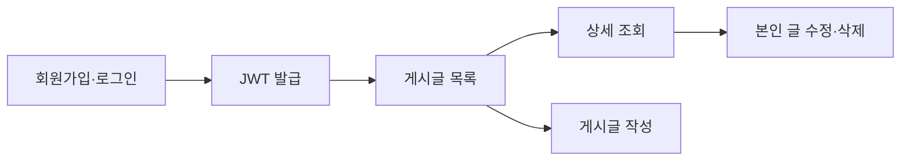
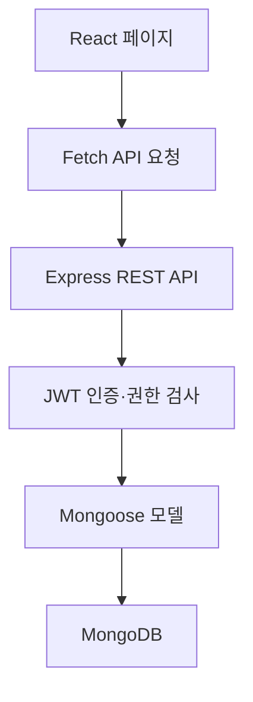
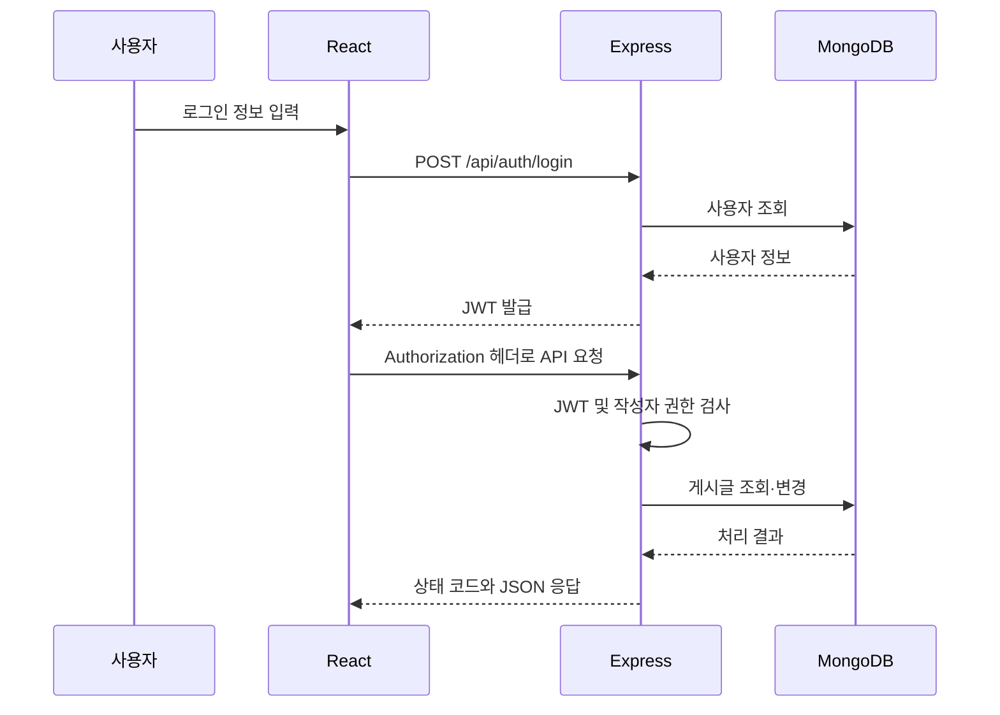

<div align="center">

# MY BOARD

### 게시판 기능을 넘어, 인증과 권한의 경계를 이해하기 위한 풀스택 프로젝트

React, Express, MongoDB를 연결해 회원가입·로그인부터  
게시글 조회·작성·수정·삭제와 작성자 권한 제어까지 구현했습니다.

<p align="center">
  
</p>

</div>

---

## 프로젝트 소개

게시판은 웹 개발의 기본 예제로 자주 사용되지만, 실제로 구현하려면 단순히 데이터를 화면에 출력하는 것보다 더 많은 흐름을 이해해야 합니다.

사용자가 입력한 데이터는 어떤 방식으로 서버에 전달되는지, 로그인한 사용자를 서버가 어떻게 식별하는지, 다른 사람의 글을 수정하지 못하도록 어디에서 권한을 검사해야 하는지, 서버가 실패 이유를 어떤 상태 코드로 전달해야 하는지를 함께 설계해야 합니다.

My Board는 다음 질문에 직접 답해보기 위해 시작한 풀스택 학습 프로젝트입니다.

> 로그인한 사용자를 어떻게 식별하고, 그 사용자가 자신의 게시글만 안전하게 관리하도록 만들 수 있을까?

React 화면과 Express REST API, MongoDB 데이터 저장소를 연결하고 JWT 인증과 작성자 권한 검증을 적용해 게시판의 전체 흐름을 구현했습니다.

---

## 구현 목표

초기에는 서버의 배열에 게시글을 저장했습니다. 하지만 서버를 재시작하면 데이터가 사라지고, 로그인 사용자와 게시글 작성자를 연결할 수도 없었습니다.

이를 다음과 같이 개선했습니다.

1. 배열 데이터를 MongoDB 문서로 전환합니다.
2. 회원 비밀번호는 bcrypt로 해시 처리합니다.
3. 로그인 성공 시 JWT 토큰을 발급합니다.
4. 인증이 필요한 요청에는 토큰을 함께 보냅니다.
5. 서버가 토큰을 검증하고 사용자를 식별합니다.
6. 게시글의 `authorId`와 로그인 사용자의 ID를 비교합니다.
7. 작성자 본인에게만 수정·삭제 권한을 허용합니다.
8. 요청 결과에 따라 의미가 다른 HTTP 상태 코드를 반환합니다.

---

## 핵심 사용자 흐름



로그인 이후 프론트엔드는 JWT를 API 요청 헤더에 담아 전송합니다. 서버는 토큰과 게시글 작성자를 순서대로 검증한 뒤 요청을 처리합니다.

---

## 주요 화면

### 1. 로그인 및 회원가입

아이디와 비밀번호로 회원가입하고 로그인할 수 있습니다.  
비밀번호는 MongoDB에 원문으로 저장하지 않고 bcrypt로 해시 처리합니다.

로그인 성공 시 서버가 JWT를 발급하며, 프론트엔드는 이후 API 요청에 사용할 수 있도록 토큰을 저장합니다.

<p align="left">
  
</p>

### 2. 게시글 목록

로그인한 사용자가 게시글 제목, 작성자, 조회수, 작성일을 확인할 수 있습니다.

현재 로그인한 사용자와 게시글의 `authorId`를 비교해 본인이 작성한 게시글에만 수정 버튼을 표시합니다.

<p align="left">
  
</p>

### 3. 게시글 상세 및 작성자 권한 제어

게시글 제목을 선택하면 MongoDB의 `_id`를 URL 파라미터로 전달해 상세 데이터를 조회합니다.

아래 화면은 `user01`이 다른 사용자 `user02`의 게시글을 조회한 상태입니다. 작성자가 아니므로 수정·삭제 버튼이 표시되지 않습니다.

<p align="left">
  
</p>

---

## 구현 기능

### 사용자 인증

- 회원가입
- 아이디 중복 검사
- 비밀번호 8자 이상 검증
- bcrypt 기반 비밀번호 해시 저장
- 로그인 및 JWT 발급
- JWT 만료 시간 설정
- 로그인 사용자 정보 조회
- 만료되거나 올바르지 않은 토큰 차단
- 로그아웃 시 브라우저의 인증 정보 제거

### 게시글

- 게시글 목록 조회
- 게시글 상세 조회
- 상세 조회 시 조회수 증가
- 게시글 작성
- 기존 제목과 내용을 불러오는 수정 화면
- 게시글 수정
- 게시글 삭제
- 제목·내용 입력 검증
- MongoDB ObjectId 형식 검증
- 최신 게시글 우선 정렬

### 권한 제어

- 인증된 사용자만 게시글 API 접근
- JWT payload를 `req.user`에 저장
- 게시글에 작성자 ID 저장
- 작성자 본인만 수정·삭제 허용
- 다른 사용자의 요청에 `403 Forbidden` 반환
- 프론트엔드에서 작성자에게만 관리 버튼 표시

### API 테스트

- WebStorm HTTP Client용 `board-api.http` 작성
- 로그인 응답의 JWT 자동 저장
- 작성된 게시글 `_id` 자동 저장
- 토큰 유무에 따른 `401` 테스트
- 다른 계정 토큰을 이용한 `403` 테스트
- 삭제 이후 `404` 테스트

---

## 기술 스택

### Frontend

| 기술 | 사용 이유 |
|---|---|
| React | 로그인, 목록, 상세, 작성, 수정 화면의 상태와 사용자 입력을 관리하기 위해 사용했습니다. |
| Vite | React 개발 환경을 빠르게 구성하고 개발 서버를 실행하기 위해 사용했습니다. |
| React Router | 목록, 로그인, 작성, 상세, 수정 화면을 URL 단위로 분리하기 위해 사용했습니다. |
| Fetch API | Express API에 HTTP 요청을 보내고 응답을 처리하기 위해 사용했습니다. |
| localStorage | 로그인 후 발급받은 JWT와 사용자 정보를 브라우저에서 유지하기 위해 사용했습니다. |
| CSS | 공통 레이아웃과 게시판 화면을 직접 구성하기 위해 사용했습니다. |

### Backend

| 기술 | 사용 이유 |
|---|---|
| Node.js | 프론트엔드와 동일한 JavaScript 언어로 서버를 구현하기 위해 사용했습니다. |
| Express | 회원과 게시글 기능을 REST API로 구성하기 위해 사용했습니다. |
| MongoDB | 사용자와 게시글 데이터를 서버 재시작 이후에도 유지하기 위해 사용했습니다. |
| Mongoose | 데이터 형식, 필수값, 기본값과 작성자 참조를 스키마로 관리하기 위해 사용했습니다. |
| JWT | 로그인한 사용자를 인증하고 API 요청에서 사용자 정보를 확인하기 위해 사용했습니다. |
| bcrypt | 비밀번호를 원문이 아닌 해시값으로 저장하기 위해 사용했습니다. |
| dotenv | JWT 비밀키를 소스코드와 분리해 관리하기 위해 사용했습니다. |
| CORS | React 개발 서버가 Express API를 호출할 수 있도록 출처를 허용하기 위해 사용했습니다. |

---

## 전체 구조

프론트엔드는 사용자 입력과 화면 상태를 관리하고, 백엔드는 인증·권한·데이터 처리 책임을 담당합니다.



### 요청 처리 흐름



---

## 데이터 모델

### User

| 필드 | 역할 |
|---|---|
| `_id` | MongoDB가 자동으로 생성하는 사용자 고유 ID |
| `userId` | 로그인에 사용하는 중복 불가 아이디 |
| `password` | bcrypt로 해시 처리한 비밀번호 |
| `createdAt` | 가입 시간 |
| `updatedAt` | 사용자 정보 수정 시간 |

### Post

| 필드 | 역할 |
|---|---|
| `_id` | 게시글 URL과 조회에 사용하는 MongoDB 고유 ID |
| `title` | 게시글 제목 |
| `content` | 게시글 내용 |
| `author` | 화면에 표시하는 작성자 아이디 |
| `authorId` | 수정·삭제 권한 확인에 사용하는 사용자 고유 ID |
| `views` | 상세 조회 횟수 |
| `createdAt` | 게시글 작성 시간 |
| `updatedAt` | 게시글 수정 시간 |

`author`는 화면에 보여줄 값이고, `authorId`는 실제 권한을 확인하기 위한 값으로 역할을 분리했습니다.

---

## 인증과 권한을 분리한 이유

로그인했다고 해서 모든 게시글을 수정할 수 있는 것은 아닙니다.

이 프로젝트에서는 인증과 권한을 다음과 같이 구분했습니다.

| 구분 | 확인하는 질문 | 처리 방식 |
|---|---|---|
| 인증 | 로그인한 사용자인가? | JWT를 검증해 `req.user` 생성 |
| 권한 | 이 게시글의 작성자인가? | `post.authorId`와 `req.user.userId` 비교 |

프론트엔드에서 수정·삭제 버튼을 숨기는 것은 사용자 경험을 위한 처리입니다. 사용자가 API를 직접 호출할 수도 있으므로, 실제 보안 판단은 반드시 백엔드에서 다시 수행하도록 구성했습니다.

```javascript
if (
  !post.authorId ||
  post.authorId.toString() !== String(req.user.userId)
) {
  return res.status(403).json({
    msg: "작성자만 게시글을 수정할 수 있습니다.",
  });
}
```

---

## HTTP 상태 코드 설계

비슷해 보이는 오류도 발생 원인이 다르므로 상태 코드를 구분했습니다.

| 상태 코드 | 의미 | 프로젝트 적용 사례 |
|---|---|---|
| `200 OK` | 요청 처리 성공 | 목록·상세 조회, 수정, 삭제 |
| `201 Created` | 새로운 데이터 생성 | 회원가입, 게시글 작성 |
| `400 Bad Request` | 요청값이 올바르지 않음 | 빈 입력값, 잘못된 ObjectId |
| `401 Unauthorized` | 인증 정보가 없거나 유효하지 않음 | 토큰 없음, 만료된 토큰 |
| `403 Forbidden` | 로그인했지만 해당 작업 권한이 없음 | 다른 사용자의 글 수정·삭제 |
| `404 Not Found` | 요청한 데이터가 존재하지 않음 | 존재하지 않거나 삭제된 게시글 |
| `500 Internal Server Error` | 서버 내부 처리 실패 | 데이터베이스 또는 서버 오류 |

---

## 이해한 핵심 내용

### `req.params`와 `req.body`의 차이

```text
GET /api/posts/게시글ID
```

URL의 게시글 ID는 `req.params.id`로 받습니다.

```json
{
  "title": "수정할 제목",
  "content": "수정할 내용"
}
```

요청 본문으로 전달한 제목과 내용은 `req.body`로 받습니다.

### MongoDB `_id`

게시글 ID를 직접 만들지 않아도 MongoDB가 문서마다 고유한 `_id`를 생성합니다. React는 이 값을 상세 페이지 주소에 사용합니다.

```jsx
<Link to={`/posts/${post._id}`}>
  {post.title}
</Link>
```

### JWT는 로그인 결과이자 다음 요청의 인증 수단

로그인은 한 번의 API 요청으로 끝나지만, 서버는 이후 요청을 보낸 사용자가 누구인지 자동으로 기억하지 않습니다.

따라서 로그인 성공 시 발급받은 JWT를 다음 API 요청의 `Authorization` 헤더에 담아 사용자를 다시 증명합니다.

```text
Authorization: Bearer {token}
```

### UI 권한과 서버 권한은 역할이 다름

프론트엔드의 버튼 숨김만으로는 다른 사용자의 요청을 막을 수 없습니다.  
프론트엔드는 사용자가 가능한 행동을 이해하도록 돕고, 백엔드는 실제 요청을 허용하거나 거부합니다.

---

## 프로젝트를 통해 얻은 인사이트

### 1. 기능보다 데이터 흐름을 먼저 이해해야 한다

게시글 작성은 입력창과 버튼만 만드는 작업이 아니었습니다.

```text
사용자 입력
→ React state
→ JSON 요청
→ Express req.body
→ Mongoose 모델
→ MongoDB 저장
→ JSON 응답
→ React 화면 반영
```

어느 한 단계에서 이름이나 데이터 형식이 달라지면 전체 기능이 연결되지 않았습니다. 화면과 서버를 따로 보는 대신 하나의 요청 흐름으로 이해하는 것이 중요했습니다.

### 2. 인증과 권한은 서로 다른 문제다

JWT가 유효하다는 것은 로그인한 사용자라는 뜻일 뿐, 모든 데이터에 대한 변경 권한이 있다는 의미는 아니었습니다.

게시글의 `authorId`를 별도로 저장하고 서버에서 현재 사용자와 비교하면서 인증과 권한의 차이를 이해했습니다.

### 3. 상태 코드는 실패 원인을 설명하는 약속이다

`401`, `403`, `404`는 모두 요청 실패처럼 보이지만 원인이 다릅니다.

상태 코드를 구분하면 프론트엔드는 로그인 화면 이동, 권한 안내, 데이터 없음 표시처럼 원인에 맞는 행동을 결정할 수 있습니다.

### 4. 테스트 요청도 프로젝트 자산이다

Thunder Client의 요청을 일회성으로 실행하는 대신 WebStorm의 `.http` 파일로 옮겼습니다.

토큰과 게시글 ID를 변수로 저장하면서 성공·실패 요청을 반복해서 검증할 수 있었고, API 테스트 과정도 Git으로 관리할 수 있었습니다.

### 5. 환경에 따라 파일과 설정을 다르게 봐야 한다

Windows에서는 파일명의 대소문자를 엄격하게 구분하지 않지만 Linux에서는 다른 파일로 처리합니다. 또한 JWT 비밀키는 코드에 직접 작성하지 않고 `.env`로 분리해야 합니다.

로컬에서 실행되는 것뿐 아니라 다른 환경에서도 재현 가능한 구조가 중요하다는 점을 확인했습니다.

---

## 헷갈렸던 지점과 정리

| 처음 헷갈렸던 부분 | 정리한 내용 |
|---|---|
| 로그인했는데 왜 다시 토큰을 보내야 하는가? | HTTP 요청은 독립적이므로 JWT로 사용자를 다시 증명해야 합니다. |
| `req.params`와 `req.body`는 무엇이 다른가? | URL 식별자는 params, 입력 데이터는 body로 받습니다. |
| 게시글 ID를 직접 만들지 않았는데 어떻게 상세 페이지를 여는가? | MongoDB가 생성한 `_id`를 URL에 사용합니다. |
| `401`과 `403`은 왜 다른가? | 401은 인증 실패, 403은 인증됐지만 권한이 없는 상태입니다. |
| 버튼을 숨기면 권한 처리가 끝나는가? | UI 처리는 편의를 위한 것이고, 실제 권한은 서버에서 검사해야 합니다. |
| 서버를 재시작하면 글이 사라졌던 이유는 무엇인가? | 배열은 메모리 데이터이고 MongoDB는 영구 저장소이기 때문입니다. |

---

## 프로젝트 구조

```text
my-board-project/
├─ backend/
│  ├─ middlewares/
│  │  └─ requireAuth.js          # JWT 인증 미들웨어
│  ├─ models/
│  │  ├─ Post.js                 # 게시글 스키마
│  │  └─ User.js                 # 사용자 스키마
│  ├─ .env.example               # 환경 변수 예시
│  ├─ board-api.http             # API 정상·실패 테스트
│  ├─ package.json
│  └─ server.js                  # Express API 및 MongoDB 연결
│
├─ frontend/
│  ├─ public/
│  ├─ src/
│  │  ├─ components/
│  │  │  └─ Header.jsx           # 로그인 사용자·글쓰기·로그아웃 메뉴
│  │  ├─ pages/
│  │  │  ├─ LoginPage.jsx
│  │  │  ├─ RegisterPage.jsx
│  │  │  ├─ PostListPage.jsx
│  │  │  ├─ PostDetailPage.jsx
│  │  │  ├─ PostWritePage.jsx
│  │  │  └─ PostEditPage.jsx
│  │  ├─ App.css
│  │  ├─ App.jsx                 # 페이지 라우팅
│  │  ├─ index.css
│  │  └─ main.jsx
│  ├─ package.json
│  └─ vite.config.js
│
├─ docs/
│  └─ screenshots/               # README 화면 이미지
├─ .gitignore
└─ README.md
```

---

## 로컬 실행 방법

### 1. 프로젝트 복제

```bash
git clone https://github.com/chaechae001/my-board-project.git
cd my-board-project
```

### 2. MongoDB 실행

로컬 MongoDB Community Server를 실행합니다.

기본 연결 주소:

```text
mongodb://127.0.0.1:27017/my_board_db
```

### 3. Backend 설정

```bash
cd backend
npm install
```

`backend/.env.example`을 참고해 `backend/.env` 파일을 생성합니다.

```env
JWT_SECRET=충분히_긴_임의의_문자열
```

Backend를 실행합니다.

```bash
npm start
```

Backend는 다음 주소에서 실행됩니다.

```text
http://localhost:4000
```

### 4. Frontend 설정

새 터미널에서 실행합니다.

```bash
cd frontend
npm install
npm run dev
```

브라우저에서 다음 주소로 접속합니다.

```text
http://localhost:5173
```

---

## API

| Method | Endpoint | 인증 | 설명 |
|---|---|:---:|---|
| `GET` | `/api/health` | X | 서버 상태 확인 |
| `POST` | `/api/auth/register` | X | 회원가입 |
| `POST` | `/api/auth/login` | X | 로그인 및 JWT 발급 |
| `GET` | `/api/auth/me` | O | 로그인 사용자 확인 |
| `GET` | `/api/posts` | O | 게시글 목록 조회 |
| `POST` | `/api/posts` | O | 게시글 작성 |
| `GET` | `/api/posts/:id` | O | 상세 조회 및 조회수 증가 |
| `PATCH` | `/api/posts/:id` | O·작성자 | 게시글 수정 |
| `DELETE` | `/api/posts/:id` | O·작성자 | 게시글 삭제 |

---

## 현재 단계와 한계

현재 프로젝트는 JWT 인증과 작성자 권한이 적용된 게시판의 핵심 사용자 흐름을 확인할 수 있는 MVP입니다.

완료된 범위:

- 회원가입·로그인
- JWT 인증
- MongoDB 기반 사용자·게시글 저장
- 게시글 목록·상세·작성·수정·삭제
- 조회수 증가
- 작성자 권한 검증
- API 성공·실패 테스트
- React 화면과 Express API 연동

현재 한계:

- JWT를 `localStorage`에 저장하고 있어 보안 방식의 추가 검토가 필요합니다.
- 상세 조회 API가 조회수 증가까지 담당해 수정 화면 진입 시에도 조회수가 증가합니다.
- 게시글 수가 많아질 경우를 위한 페이지네이션과 검색이 없습니다.
- 자동화된 단위·통합 테스트가 없습니다.
- 로컬 MongoDB와 고정 API 주소를 사용해 별도의 배포 설정이 필요합니다.

---

## 향후 개선 계획

- HttpOnly Cookie 기반 인증 방식 검토
- 조회 API와 조회수 증가 로직 분리
- 게시글 검색 및 페이지네이션
- 이미지 업로드 및 미리보기
- API 단위·통합 테스트
- 프론트엔드 API 주소 환경 변수화
- 운영 환경별 CORS와 MongoDB 연결 설정
- 배포 환경 구성

---